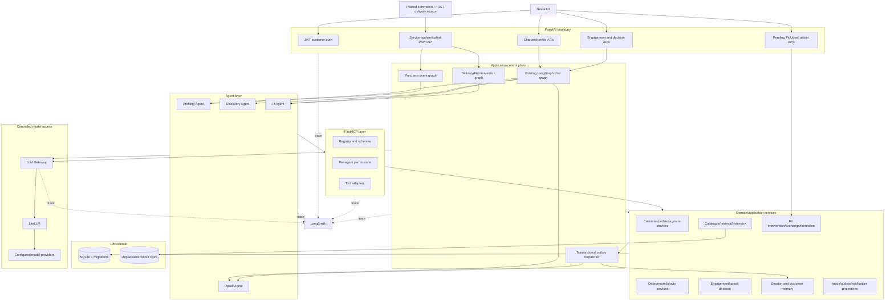
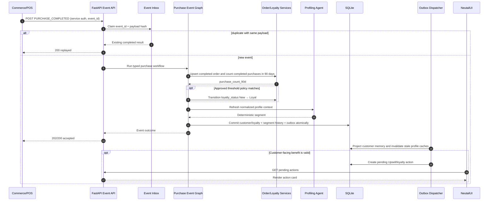
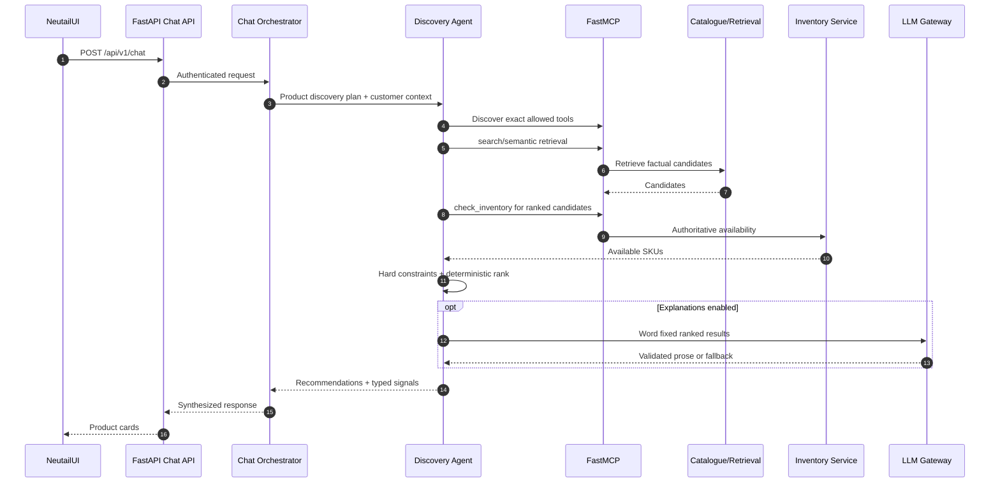
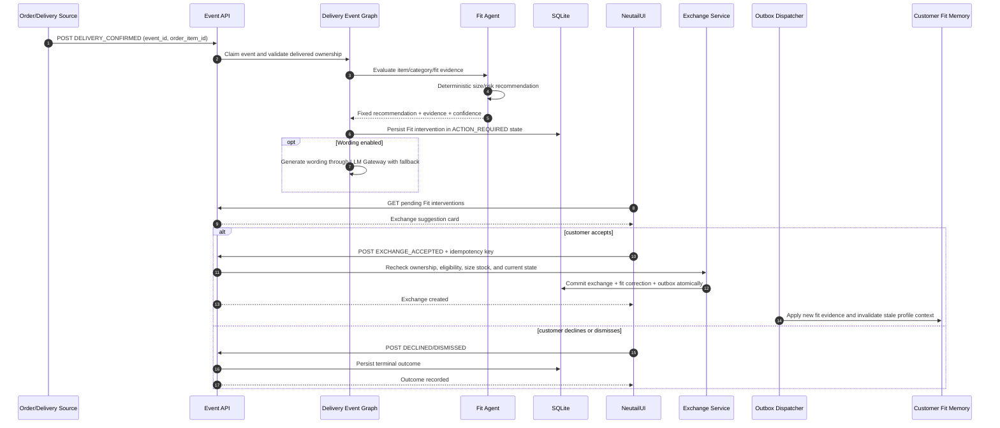

# Neu.Tail Mission 4 — Three-Sequence Implementation Design

**Status:** Proposed implementation design; homepage recommendation slice implemented  
**Frontend:** NeutailUI  
**Backend:** FastAPI, LangGraph, FastMCP, SQLAlchemy/SQLite, LiteLLM, LangSmith  
**Scope:** Customer profiling and segmentation, product discovery and engagement-driven upsell, and post-delivery size-and-fit intervention

## 1. Purpose

This document converts the three supplied sequence diagrams into one coherent,
implementable design for the current Neu.Tail codebase. It describes:

- what the application already supports;
- the gaps between the diagrams and the code;
- deliberate corrections where a diagram is unsafe or internally inconsistent;
- the target high-level architecture;
- API, event, persistence, service, tool, agent, orchestrator, and NeutailUI changes;
- transaction, security, observability, testing, migration, and rollout details.

The three target use cases are:

1. **Customer profiling and segmentation after purchase activity.**
2. **Product discovery plus engagement-driven service upsell.**
3. **Post-delivery size-and-fit guidance with a customer-approved exchange.**

The document is a change design, not a claim that the target architecture is
already implemented.

## 2. Executive summary

The current application is a strong synchronous demo: authenticated FastAPI
routes call a LangGraph orchestrator, agents access domain data through
permissioned FastMCP tools, deterministic code owns business decisions, and all
optional model calls pass through the LiteLLM gateway with LangSmith tracing.

The three diagrams require a second execution style in addition to chat:
**durable business-event processing**. Purchase completion and delivery
confirmation are facts from trusted commerce systems, not natural-language
intents. They therefore should not be sent through the chat intent classifier.

The required architectural changes are:

1. Add authenticated, idempotent ingestion for purchase and delivery events.
2. Add persistent workflow state, event inbox/outbox records, and durable agent
   decisions; eliminate process-local state from business-critical flows.
3. Keep segmentation, retrieval/ranking, fit calculations, policy, and points
   calculations deterministic. Use the LLM only to explain or word an already
   fixed result.
4. Make NeutailUI the customer interaction and consent surface. An exchange,
   service interest, or subscription must never be created just because an
   agent recommended it.
5. Add a persistent customer-memory projection and invalidate cached profile
   context when purchases, segment, loyalty, or fit evidence changes.
6. Use a transactional SQLite outbox and an in-process dispatcher for the PoC.
   This provides replay and traceability without introducing Kafka or another
   infrastructure dependency. The interface can later be backed by a broker.
7. Correct the profiling rule inconsistency: `Affluent + New` maps to
   `Aspiring Loyalist`, not `Prestige Champion`. If three completed purchases
   in 90 days should produce `Prestige Champion`, an explicit loyalty-status
   transition from `New` to `Loyal` must occur before segment classification.

## 3. Scope and non-goals

### 3.1 In scope

- Changes required in this repository and its contracts with NeutailUI.
- A single-process demo deployment using SQLite.
- Restart-safe event handling, decision state, pending UI actions, and customer
  memory.
- Explicit API and data contracts for simulated or real commerce integrations.
- LangGraph orchestration, FastMCP access control, LiteLLM gateway usage, and
  LangSmith trace requirements.

### 3.2 Out of scope for the first implementation

- A production message broker, distributed workflow engine, or multi-region
  deployment.
- A real payment or subscription activation flow.
- Automatic exchange shipment without customer confirmation.
- A hosted production vector database. The existing replaceable local vector
  mechanism remains acceptable for the demo.
- SMS, email, or push delivery unless a real notification provider is added.
  NeutailUI is the required customer-facing channel.

## 4. Current implementation baseline

The following components are already present and should be retained:

| Area | Current implementation | Assessment |
| --- | --- | --- |
| API boundary | `api/main.py`, authentication, customer, session, chat/profile, engagement, and upsell decision routes | Reuse and extend |
| Orchestration | `orchestrator/orchestrator.py` LangGraph chat graph, deterministic planning, direct upsell-trigger handler | Retain chat graph; add event graphs |
| Profiling | Five exact tools, normalized context, deterministic 2x2 classifier, process-local cache | Core logic is correct; add durable triggers and invalidation |
| Discovery | Structured/semantic/hybrid retrieval, hard constraints, deterministic ranking, inventory check, optional LLM explanation | Core logic is correct |
| Fit | Tool-driven evidence, deterministic size/risk calculation, optional LLM explanation | Core logic is correct; add intervention workflow |
| Upsell | Deterministic eligibility, scoring and offer selection; LLM wording only | Core logic is correct; persist decisions |
| FastMCP | Registry, contracts, exact agent allowlists, adapters | Extend with narrowly scoped write tools |
| LLM gateway | Central LiteLLM gateway, configured routes and prompts, validation/fallback, telemetry | Reuse; add wording use cases only |
| Observability | LangSmith traces around agents, tools, and gateway | Extend across event workflows |
| Persistence | Seeded SQLite domain data | Add migrations and workflow tables |
| Session memory | Process-local session context and last 20 messages | Must become durable for restart-safe UI flows |
| Idempotency | Process-local engagement/decision bookkeeping | Must move to the database |

### 4.1 Current gaps by sequence

| Sequence | What works now | Material gaps |
| --- | --- | --- |
| Profiling and segmentation | Profile facts, purchase history, loyalty facts, deterministic segment derivation | No purchase-event endpoint, no 90-day threshold, no durable segment transition/history, no event publication, no cache invalidation, no points write, no loyalty subscriber |
| Discovery and upsell | Normal chat discovery checks inventory; third premium product view can synchronously trigger Upsell; explicit decision-event endpoint exists | Engagement idempotency and decisions are process-local; third-view flow does not run Discovery; no durable signal/outbox; source is mislabeled as `DiscoveryAgent`; no pending-decision reload endpoint; no email notification |
| Size and fit | Chat-based FitAgent obtains evidence and makes deterministic recommendations | No delivery timer/event, no persisted intervention, no NeutailUI consent flow, no exchange service, no correction write, no downstream profile-memory update |

## 5. Architectural decisions

### AD-1: Separate conversational commands from domain events

`POST /api/v1/chat` continues to use intent detection and the existing chat
graph. Trusted events such as `PURCHASE_COMPLETED` and `DELIVERY_CONFIRMED`
enter separate event workflows. They already have a known type and do not need
LLM intent classification.

### AD-2: NeutailUI owns customer consent

NeutailUI displays pending Fit and Upsell actions. The backend executes a
customer-affecting operation only after an authenticated, ownership-checked,
idempotent accept event. Decline and dismiss events are also stored.

### AD-3: Deterministic decisions; LLM for language only

| Decision | Owner |
| --- | --- |
| Segment classification | `SegmentClassifier` |
| Purchase threshold and loyalty transition | versioned domain policy |
| Search constraints and product ranking | Discovery code |
| Inventory availability | `InventoryService` |
| Size recommendation and fit risk | `FitCalculator` and fit policy |
| Upsell eligibility, suppression, score, and selected offer | Upsell policy/scorer/selector |
| Points delta | loyalty accrual policy |
| Customer-facing wording | optional LLM gateway with deterministic fallback |

An LLM failure may reduce prose quality; it must not change the business
outcome or prevent a valid deterministic response.

### AD-4: SQLite inbox/outbox for the demo

The PoC uses database tables and an in-process dispatcher:

- an **event inbox** deduplicates trusted inbound events;
- the domain write and **outbox event** are committed in one transaction;
- a dispatcher claims pending outbox rows, invokes internal subscribers, and
  records success/retry/dead-letter state.

This is the demo implementation of the diagrams' “Shared Context Bus.” A future
Kafka/SNS/EventBridge adapter can implement the same publisher/subscriber
interfaces without changing agents.

### AD-5: Agents use FastMCP; event handlers use application services

Agent reads and agent-requested actions continue to go through permissioned
FastMCP tools. API event handlers and outbox consumers are trusted application
components and call application services/repositories directly. This avoids
pretending that every deterministic system event is an agent conversation.

### AD-6: Facts, projections, and recommendations are distinct

- Historical orders and returns remain immutable facts.
- `customer_fit_memory` and current segment/loyalty are projections from facts.
- Fit and Upsell records are recommendations/decisions with explicit states.
- Accepting an exchange nudge does not rewrite an old return rate.
- Displaying an “x3 points” message is forbidden unless a points policy has
  actually posted the corresponding transaction.

## 6. Target high-level architecture



### 6.1 Runtime paths

1. **Chat path:** NeutailUI → FastAPI → existing LangGraph chat graph → agents
   → FastMCP → domain services → response.
2. **Customer engagement path:** NeutailUI → engagement API → persisted view →
   threshold evaluation → Upsell → persisted decision → immediate UI result.
3. **Trusted event path:** commerce source → event API → inbox → specialized
   event graph → transactional domain writes/outbox → projections/pending UI
   action.
4. **Consent path:** NeutailUI → action API → ownership/state/idempotency checks
   → domain command → outbox → updated UI-visible state.

## 7. Corrected end-to-end sequences

### 7.1 Purchase completion → profile/segment transition



Important correction: the current matrix maps `Affluent + New` to
`Aspiring Loyalist`. `Prestige Champion` is obtained only after an approved
rule changes the loyalty status to `Loyal`, followed by classification. The
event handler must record both the previous and new values and the policy
version that caused the transition.

An LLM may create a friendly explanation after the segment is fixed, but it
must not choose the segment.

### 7.2 Normal product discovery



This path already substantially exists. It should not be confused with the
third-product-view flow below.

### 7.3 Third premium product view → governed upsell

```mermaid
sequenceDiagram
    autonumber
    participant UI as NeutailUI
    participant API as Engagement API
    participant ES as Engagement Service
    participant INV as Inventory Service
    participant O as Orchestrator
    participant U as Upsell Agent
    participant DB as SQLite

    UI->>API: POST PRODUCT_VIEWED (session, SKU, idempotency key)
    API->>ES: Validate active product and persist event
    ES->>INV: Read current availability if offer depends on SKU availability
    ES-->>API: Customer/session/SKU view count
    alt exactly third qualifying view and available
        API->>O: HIGH_PRODUCT_ENGAGEMENT trigger
        O->>U: Profile first if required, then evaluate trigger
        U->>U: Policy + suppression + score + offer selection
        U->>DB: Persist decision and OFFER_SHOWN
        U-->>API: Offer/no-offer result
    else not threshold or unavailable
        API-->>UI: Event recorded; no offer
    end
    API-->>UI: Durable decision_id and optional offer card
    UI->>API: POST ACCEPTED / DECLINED / DISMISSED
    API->>DB: Ownership check + idempotent state transition
    API-->>UI: Recorded outcome
```

The event source is `EngagementEventService`, not `DiscoveryAgent`, unless the
Discovery Agent genuinely emitted the event during its own run. No intent
classification or vector search is necessary for a known `PRODUCT_VIEWED`
event. If the required business outcome is a related-product recommendation,
that is a separate trigger that should explicitly invoke Discovery.

`OFFER_ACCEPTED` records interest. It does not by itself activate or charge for
a service.

### 7.4 Delivery confirmation → Fit intervention → approved exchange



There is intentionally no “customer accepts” step inferred from silence and no
unilateral exchange. For the PoC, `ExchangeService` may create an internal
simulated exchange record, but the API must label it as simulated until a real
returns/exchange integration exists.

## 8. Domain state models

### 8.1 Inbound event

```text
RECEIVED → PROCESSING → COMPLETED
                     ↘ FAILED_RETRYABLE → PROCESSING
                     ↘ DEAD_LETTER
```

- `event_id` is globally unique.
- Reusing an ID with a different payload hash returns `409`.
- Replaying the same completed event returns its stored outcome.
- A processing lease permits recovery after process failure.

### 8.2 Fit intervention

```text
ACTION_REQUIRED → ACCEPTED → EXCHANGE_CREATED
               ↘ DECLINED
               ↘ DISMISSED
               ↘ EXPIRED

ACCEPTED → FAILED_RETRYABLE → EXCHANGE_CREATED
```

Only `ACTION_REQUIRED` can accept, decline, dismiss, or expire. Acceptance must
not be marked complete before the exchange transaction succeeds. If external
exchange creation is eventually asynchronous, use `ACCEPTED`/`PROCESSING` and
show that state accurately in NeutailUI.

### 8.3 Upsell decision

```text
OFFER_AVAILABLE → INTEREST_RECORDED
                ↘ DECLINE_RECORDED
                ↘ DISMISSAL_RECORDED
                ↘ EXPIRED

NO_OFFER and FAILED are terminal evaluation outcomes.
```

The existing API states are retained. Persist them instead of storing them in
the process-local `UpsellDecisionService` dictionaries.

### 8.4 Outbox event

```text
PENDING → PROCESSING → PUBLISHED
                    ↘ RETRY → PROCESSING
                    ↘ DEAD_LETTER
```

Subscribers are idempotent by `(event_id, subscriber_name)`.

## 9. Persistence design

Use Alembic (or a small explicit versioned migration runner for the demo) rather
than mutating the checked-in database manually. Tests must create a temporary
database from migrations and seed data.

### 9.1 New tables

#### `event_inbox`

| Column | Type/constraint | Purpose |
| --- | --- | --- |
| `event_id` | text PK | Producer idempotency key |
| `event_type` | text, indexed | `PURCHASE_COMPLETED`, `DELIVERY_CONFIRMED`, etc. |
| `schema_version` | integer | Payload compatibility |
| `payload_json` | text | Canonical accepted payload |
| `payload_hash` | text | Detect key reuse with different data |
| `status` | text, indexed | Processing state |
| `attempt_count` | integer | Retry control |
| `lease_until` | datetime nullable | Crash recovery |
| `result_json` | text nullable | Replay-safe response |
| `error_code` | text nullable | Sanitized diagnostic |
| `received_at`, `updated_at` | datetime | Audit |

#### `outbox_events`

| Column | Type/constraint | Purpose |
| --- | --- | --- |
| `outbox_id` | text PK | Internal event identity |
| `aggregate_type`, `aggregate_id` | text, indexed | Ordering/correlation |
| `event_type` | text, indexed | Subscriber routing |
| `schema_version` | integer | Contract version |
| `payload_json` | text | Event body |
| `trace_id`, `causation_id`, `correlation_id` | text | End-to-end tracing |
| `status`, `attempt_count`, `next_attempt_at` | indexed | Dispatch/retry |
| `created_at`, `published_at` | datetime | Audit |

Add `outbox_deliveries(outbox_id, subscriber_name, status, attempts,
last_error, updated_at)` if more than one independent subscriber is enabled.

#### `customer_segment_history`

| Column | Type/constraint | Purpose |
| --- | --- | --- |
| `segment_history_id` | text PK | Transition identity |
| `customer_id` | FK + index | Owner |
| `previous_segment`, `new_segment` | text | Audit |
| `previous_loyalty_status`, `new_loyalty_status` | text | Explains matrix input |
| `affluence_band` | text | Matrix input snapshot |
| `purchase_count_90d` | integer | Threshold evidence |
| `policy_version` | text | Reproducibility |
| `source_event_id` | unique FK-like reference | Idempotency/audit |
| `changed_at` | datetime | Effective time |

#### `fit_interventions`

| Column | Type/constraint | Purpose |
| --- | --- | --- |
| `intervention_id` | text PK | UI/action identity |
| `customer_id` | FK + index | Ownership |
| `session_id` | nullable | Optional chat correlation |
| `order_id`, `order_item_id`, `sku` | indexed references | Delivered item |
| `delivered_size`, `recommended_size` | text | Fixed recommendation |
| `risk_level`, `confidence` | text/real | Fixed decision |
| `reason_codes_json`, `evidence_json` | text | Explainability |
| `message` | text nullable | LLM or fallback wording |
| `status` | text + index | State machine |
| `source_event_id` | unique | One intervention per trigger |
| `expires_at`, `created_at`, `updated_at` | datetime | Lifecycle |
| `version` | integer | Optimistic concurrency |

#### `exchange_requests`

| Column | Type/constraint | Purpose |
| --- | --- | --- |
| `exchange_id` | text PK | Exchange identity |
| `intervention_id` | unique FK | Exactly one accepted exchange |
| `customer_id`, `order_item_id`, `sku` | indexed | Ownership/reference |
| `from_size`, `to_size` | text | Exchange details |
| `status` | text | Requested/created/failed/completed |
| `provider_reference` | nullable text | External system identity |
| `simulated` | boolean | Prevents false production claims |
| timestamps | datetime | Audit |

#### `fit_corrections`

| Column | Type/constraint | Purpose |
| --- | --- | --- |
| `correction_id` | text PK | Evidence identity |
| `customer_id`, `sku`, `order_item_id` | indexed | Subject |
| `from_size`, `to_size` | text | Correction |
| `source` | text | `ACCEPTED_EXCHANGE`, later return outcome, etc. |
| `confidence` | real | Evidence weight |
| `source_event_id` | unique | Deduplication |
| `recorded_at` | datetime | Audit |

#### `customer_fit_memory`

| Column | Type/constraint | Purpose |
| --- | --- | --- |
| `customer_id` | FK | Owner |
| `scope_type`, `scope_key` | compound PK | Global/category/brand/SKU projection |
| `preferred_size`, `fit_preference` | text | Current projection |
| `confidence` | real | Do not overstate weak evidence |
| `evidence_count` | integer | Explainability |
| `source_correction_id` | text | Last causal fact |
| `version`, `updated_at` | integer/datetime | Concurrency/cache invalidation |

#### `upsell_decisions`

Persist the current `UpsellDecisionRecord` fields, plus:

- fixed offer details and message;
- customer/session/trigger ownership;
- status and version;
- policy/model/prompt versions;
- eligibility/suppression reason JSON;
- created, expires, and updated timestamps.

Add `upsell_decision_events` with a unique constraint on
`(decision_id, idempotency_key)` and a uniqueness rule that prevents conflicting
terminal customer responses.

#### `sessions` and `conversation_turns`

Replace process-local session storage with:

- a `sessions` row containing customer binding, channel, current entities,
  selected SKU, current intent, turn count, customer-context version, and
  timestamps;
- ordered `conversation_turns` with role, content, trace ID, and timestamp;
- retention of the latest 20 turns in request context, while older rows can be
  retained or expired by policy.

#### `customer_memory`

A compact cross-session projection, not an unlimited transcript:

| Field | Examples |
| --- | --- |
| `customer_id` | projection owner |
| `memory_type` | `SEGMENT`, `FIT`, `PREFERENCE`, `RECENT_INTEREST` |
| `memory_key` | category/brand/SKU or `current` |
| `value_json` | normalized value and supporting facts |
| `confidence` | evidence quality |
| `source_event_id` | provenance |
| `version`, `updated_at`, `expires_at` | freshness and retention |

The profiling agent reads this projection through a tool; it does not read raw
event or transcript tables.

### 9.2 Existing table changes

- Add `updated_at` and an integer `profile_version` to `customers`.
- Continue storing the current derived `segment` in `customers`, but treat
  `customer_segment_history` as its audit trail.
- Add `updated_at`/`version` to `loyalty` and `fit_profiles`.
- Add a unique producer reference to orders if purchase events can be retried.
- Keep `loyalty_transactions` as the immutable points ledger. Update
  `loyalty.points_balance` and insert the ledger row in one transaction.
- Consider a foreign key from `clickstream.sku` to `products.sku` after seed
  data validation; application validation remains mandatory.

### 9.3 Essential indexes and constraints

- `orders(customer_id, order_datetime, status)` for rolling purchase counts.
- `clickstream(customer_id, session_id, sku, event_type, event_datetime)` for
  engagement thresholds.
- `fit_interventions(customer_id, status, created_at)` for NeutailUI pending
  actions.
- `upsell_decisions(customer_id, status, created_at)` for pending offers.
- `outbox_events(status, next_attempt_at, created_at)` for dispatch.
- Unique `(producer, producer_event_id)` if multiple event producers exist.
- Check constraints for all state-machine values where SQLite permits them.

## 10. API design

### 10.1 Trusted commerce-event API

`POST /internal/v1/events`

- Authentication: service token or signed producer credential, never a
  customer JWT.
- Required headers: `X-Request-ID`; optional producer signature.
- Idempotency: `event_id` in the body.
- Response: `202 Accepted` for new durable work; `200 OK` for a completed
  replay; `409 Conflict` for the same ID with a different payload.

```json
{
  "event_id": "evt_purchase_123",
  "event_type": "PURCHASE_COMPLETED",
  "occurred_at": "2026-09-19T10:00:00Z",
  "schema_version": 1,
  "customer_id": "CUST001",
  "data": {
    "order_id": "ORD123",
    "channel": "WEB",
    "status": "COMPLETED",
    "items": [
      {"order_item_id": "ITEM123", "sku": "SKU001", "quantity": 1,
       "unit_price_gbp": 120.0, "size": "M"}
    ]
  }
}
```

For delivery:

```json
{
  "event_id": "evt_delivery_123",
  "event_type": "DELIVERY_CONFIRMED",
  "occurred_at": "2026-09-19T10:00:00Z",
  "schema_version": 1,
  "customer_id": "CUST001",
  "data": {
    "order_id": "ORD123",
    "order_item_id": "ITEM123",
    "delivered_at": "2026-09-18T10:00:00Z"
  }
}
```

The server resolves product/category/price/size facts from the order record; it
does not trust duplicated client facts in the event payload.

### 10.2 Event status API

`GET /internal/v1/events/{event_id}` returns durable processing status and a
sanitized result. This is service-authenticated and supports demo diagnostics.

### 10.3 Fit intervention APIs for NeutailUI

| Method/path | Purpose |
| --- | --- |
| `GET /api/v1/fit/interventions?status=ACTION_REQUIRED` | List authenticated customer's pending/recent interventions |
| `GET /api/v1/fit/interventions/{intervention_id}` | Fetch one owned intervention |
| `POST /api/v1/fit/interventions/{intervention_id}/events` | Accept, decline, or dismiss |

Request:

```json
{
  "event_type": "EXCHANGE_ACCEPTED",
  "idempotency_key": "ui-fit-123",
  "selected_size": "L"
}
```

`selected_size` must be one of the server-provided allowed sizes and is
revalidated against inventory at acceptance time. Responses return the new
state and, when applicable, the exchange ID and whether the exchange is
simulated.

### 10.4 Engagement and Upsell APIs

Keep the existing:

- `POST /api/v1/engagement/events`;
- `POST /api/v1/upsell/decisions/{decision_id}/events`.

Change their backing state to database persistence and add:

| Method/path | Purpose |
| --- | --- |
| `GET /api/v1/upsell/decisions?status=OFFER_AVAILABLE` | Reload pending offers after refresh/restart |
| `GET /api/v1/upsell/decisions/{decision_id}` | Fetch one owned decision |

Continue to require a valid session on new engagement events. A pending
decision lookup is customer-bound and need not require the original session to
still be active.

### 10.5 Optional unified action feed

After the separate APIs are stable, NeutailUI may use:

`GET /api/v1/actions?status=ACTION_REQUIRED&limit=20`

The response is a discriminated union of `FIT_INTERVENTION`, `UPSELL_OFFER`,
and `LOYALTY_UPDATE`. The action feed is a read projection only; mutations
continue through domain-specific endpoints.

### 10.6 Error contract

Reuse `ErrorResponse` and standardize these codes:

- `INVALID_SESSION`
- `RESOURCE_NOT_FOUND`
- `RESOURCE_NOT_OWNED` (return as `404` to avoid disclosure)
- `IDEMPOTENCY_CONFLICT`
- `INVALID_STATE_TRANSITION`
- `INVENTORY_CHANGED`
- `EXCHANGE_NOT_ELIGIBLE`
- `EVENT_SCHEMA_UNSUPPORTED`
- `EVENT_PROCESSING_FAILED`
- `DEPENDENCY_UNAVAILABLE`

All errors contain `trace_id`; no raw provider, database, prompt, or PII detail
is exposed.

## 11. Service and repository design

### 11.1 New application services

| Proposed file | Responsibility |
| --- | --- |
| `services/event_inbox_service.py` | Claim/replay/fail inbound events using leases and payload hashes |
| `services/outbox_service.py` | Append, claim, retry, and complete outbox events |
| `services/commerce_event_service.py` | Validate event envelope and dispatch typed purchase/delivery commands |
| `services/customer_segmentation_service.py` | Apply versioned loyalty threshold, invoke deterministic classification, persist transition/history |
| `services/profile_invalidation_service.py` | Increment profile version, clear local caches, mark active session context stale |
| `services/fit_intervention_service.py` | Create/list/get/transition Fit interventions with ownership and concurrency checks |
| `services/exchange_service.py` | Validate order item, eligibility and stock; create simulated or provider-backed exchange |
| `services/fit_correction_service.py` | Write immutable correction and update fit-memory projection |
| `services/customer_memory_service.py` | Read/write compact cross-session projections |
| `services/loyalty_accrual_service.py` | Optional deterministic points ledger and balance update |
| `services/action_feed_service.py` | Optional read-only union of pending customer actions |

### 11.2 Existing service changes

| Existing file | Required change |
| --- | --- |
| `services/order_history_service.py` | Add completed-purchase count with explicit `as_of`, window days, and allowed statuses |
| `services/loyalty_service.py` | Retain reads; add a separate write policy/service rather than mixing side effects into read methods |
| `services/customer_profile_service.py` | Return `profile_version`; support fresh reads after projection changes |
| `services/engagement_event_service.py` | Persist/check producer idempotency transactionally; identify the source as engagement; optionally check inventory |
| `services/upsell_decision_service.py` | Replace dictionaries/locks with repository-backed records and optimistic state transitions |
| `services/session_context_service.py` | Replace process-local map with session/turn repositories; preserve existing public behavior |
| `services/inventory_service.py` | Add size-aware availability if inventory data can represent size; otherwise explicitly report this demo limitation |
| `services/fit_profile_service.py` | Fold durable fit-memory evidence into the normalized profile without overwriting immutable facts |

### 11.3 New repositories

Create repository classes for event inbox/outbox, sessions, segment history,
Fit interventions, exchanges/corrections/memory, and Upsell decisions. Repository
methods accept a caller-owned SQLAlchemy session so multi-table domain changes
can share one transaction.

Do not hide commits inside repositories. The application service owns the
transaction boundary.

## 12. DTO and ORM changes

### 12.1 DTO modules

Avoid allowing `models/dto.py` to become an unbounded file. Add:

- `models/events.py` for event envelopes and processing results;
- `models/interventions.py` for Fit actions, exchanges, and corrections;
- `models/memory.py` for customer-memory projections;
- retain `models/upsell.py` for Upsell contracts;
- retain current profile/product DTOs in `models/dto.py` until a separate
  refactor is justified.

All request models use `extra="forbid"`. Event DTOs include schema version,
occurred time, producer identity, and correlation metadata. Public responses
must not expose raw evidence that contains sensitive internal attributes.

### 12.2 ORM entities

Add the tables in Section 9 to `models/entities.py` or split workflow entities
into `models/workflow_entities.py` and import them before metadata creation.
Choose one pattern and make migration autogeneration aware of all metadata.

## 13. Agent changes

### 13.1 Profiling Agent

Keep the existing five authoritative reads and deterministic classifier. Add:

- a `get_customer_memory` tool for compact segment/fit/preferences projections;
- `profile_version` to cache keys or cache validation;
- explicit invalidation by customer, not only `clear_session()`;
- a configurable purchase-summary window when invoked by the purchase graph;
- provenance in the result: classifier version, fact timestamps, and whether
  the segment changed.

The Profiling Agent should not directly update loyalty points. The purchase
event workflow applies the threshold policy, then asks Profiling to derive the
segment from the resulting authoritative facts.

### 13.2 Discovery Agent

Retain the current retrieval/ranking pipeline and inventory validation. Changes:

- persist any downstream behavior signal only through the orchestrator/event
  service, not as an in-memory attribute;
- do not claim responsibility for UI product-view events it did not emit;
- include retrieval strategy and inventory-check timestamps in traces;
- ensure out-of-stock candidates cannot be described as available.

No new LLM ranking step is needed. If a business requirement explicitly asks
for an LLM reranker, it must be constrained to an already valid candidate set,
schema-validated, feature-flagged, and fall back to deterministic ranking.

### 13.3 Fit Agent

Reuse its existing evidence and `FitCalculator`. Add a typed event-mode request
that includes `customer_id`, `order_item_id`, `sku`, delivered size, and trace
metadata. The agent returns a fixed intervention proposal; it does not create
an exchange.

The proposal should include:

- recommended size and allowed alternatives;
- confidence/risk band;
- machine-readable reason codes;
- evidence snapshot/version;
- expiry recommendation;
- optional wording generated through the gateway.

### 13.4 Upsell Agent

Retain deterministic policy, scoring, selection, and optional wording. Changes:

- persist every evaluation outcome and customer-visible decision;
- include `source_component` and `source_event_id` instead of falsely labeling
  all engagement triggers as Discovery signals;
- make offer expiry and decision version explicit;
- record `OFFER_SHOWN` in the same transaction as the persisted decision, or
  via an idempotent outbox subscriber;
- keep acceptance as interest unless a separate fulfillment API confirms a
  service activation.

### 13.5 Loyalty/Gamification Agent decision

A new agent is **not required** merely to increment points. A deterministic
`LoyaltyAccrualService` is safer and sufficient. Add a Loyalty/Gamification
Agent only if the product genuinely needs conversational explanation or a
choice among governed benefit campaigns. Even then:

- points calculation and posting remain deterministic tools;
- the agent cannot invent a multiplier;
- the API returns a benefit only after the ledger transaction commits;
- its FastMCP allowlist is separate from Profiling and Upsell.

## 14. FastMCP changes

### 14.1 Proposed tools

| Tool | Agent allowlist | Behavior |
| --- | --- | --- |
| `get_customer_memory` | Profiling, Fit | Read compact durable projections |
| `get_order_item_for_fit` | Fit | Read owned delivered item facts |
| `create_fit_intervention` | Fit only if agent-managed persistence is chosen | Persist a proposal; application graph is preferred owner |
| `evaluate_exchange_eligibility` | Fit | Read-only precheck; acceptance API rechecks |
| `record_fit_correction` | No general agent access; trusted workflow adapter only | Persist correction after accepted exchange |
| `get_loyalty_campaign` | Upsell or optional Loyalty agent | Read approved benefits |
| `post_loyalty_points` | Optional Loyalty agent with narrow permission | Idempotent policy-controlled write |

Prefer application-service writes from event graphs for the first version. Add
an agent write tool only when the agent genuinely owns that command. Every new
tool must define Pydantic input/output contracts, purpose, side-effect metadata,
permission tests, and LangSmith tracing.

### 14.2 Permission rules

- Default deny.
- Discovery cannot write customer profile, loyalty, exchange, or Upsell state.
- Profiling cannot create exchanges or offers.
- Fit cannot post points or activate services.
- Upsell cannot change customer segment or create an exchange.
- Trusted event subscribers are application identities, not fake agent names.

## 15. Orchestrator design

### 15.1 Preserve the existing chat graph

The current graph remains responsible for identity, session context, intent,
capability discovery, plan execution, response synthesis, and persistence.
Refactor shared execution helpers only when necessary.

### 15.2 Add a purchase-event graph

Suggested state:

```python
class PurchaseEventState(TypedDict):
    event: PurchaseCompletedEvent
    trace_id: str
    order_persisted: bool
    purchase_count_90d: int
    loyalty_before: str | None
    loyalty_after: str | None
    segment_before: str | None
    segment_after: str | None
    customer_context: CustomerContext | None
    outbox_ids: list[str]
    errors: list[str]
```

Nodes:

```text
validate_event
  → persist_order
  → calculate_purchase_window
  → apply_loyalty_threshold
  → refresh_profile
  → persist_segment_transition_and_outbox
  → finalize_inbox
```

Do not call `classify_intent`. The graph is selected by `event_type`.

### 15.3 Add a delivery/Fit graph

Suggested state:

```python
class DeliveryFitState(TypedDict):
    event: DeliveryConfirmedEvent
    trace_id: str
    order_item: OrderItemDTO | None
    eligible_for_intervention: bool
    fit_result: FitResult | None
    intervention_id: str | None
    errors: list[str]
```

Nodes:

```text
validate_delivery
  → load_order_item
  → evaluate_category_and_eligibility
  → run_fit_agent
  → persist_intervention
  → finalize_inbox
```

The 24-hour delay belongs to the event producer or a scheduler. For a demo,
accept `DELIVERY_CONFIRMED` immediately and support an optional `not_before`
timestamp that the dispatcher honors. Do not block an API worker with sleep.

### 15.4 Engagement-trigger handling

Retain `handle_upsell_trigger`, but:

- accept `source_component` and `source_event_id`;
- use database-backed profile/session/decision state;
- ensure concurrent third-view requests produce at most one trigger/decision;
- save the decision before returning it;
- expose the same result after application restart.

### 15.5 Cache invalidation and active sessions

When `CUSTOMER_SEGMENT_CHANGED` or `FIT_CORRECTION_RECORDED` is dispatched:

1. increment the customer's profile version;
2. update the durable customer-memory projection;
3. clear in-process Profiling cache entries for that customer;
4. mark durable session customer context stale;
5. refresh lazily on the next chat turn, or eagerly only for currently active
   demo sessions.

This demonstrates true cross-session memory without injecting all historical
messages into every prompt.

## 16. LLM gateway changes

Add optional use cases and versioned prompts:

| Use case | Input | Output | Fallback |
| --- | --- | --- | --- |
| `fit_intervention_wording` | Fixed size/risk result and safe product facts | Short customer-facing nudge | Deterministic template |
| `segment_change_explanation` | Fixed before/after segment and approved benefit | Explanation without unsupported claims | Deterministic template |
| `loyalty_benefit_wording` | Committed points/benefit facts | UI copy | Deterministic template |

Do not hard-code Claude or another provider in an agent. Add routes to
`llm_gateway/config/models.yaml`; invoke via `LLMGateway`; keep schema
validation, redaction, token/cost telemetry, timeout, and fallback behavior.

Model inputs must not contain full payment details, credentials, raw email
addresses, or unnecessary transcript history.

## 17. NeutailUI changes

This section is based on inspection of the actual sibling repository at
`../NeutailUI`, not only on the supplied sequence diagrams. The frontend is a
Vite/React/TypeScript application using React Router, TanStack Query, Zustand,
Axios, and Tailwind.

### 17.1 Current NeutailUI baseline

| Existing area | Current behavior | Reuse/change decision |
| --- | --- | --- |
| `src/App.tsx` | Provides the shared TanStack `QueryClient` and auth/bootstrap wrappers | Reuse; configure action-query defaults if needed |
| `src/api/client.ts` | Attaches JWT and centrally handles `401` | Reuse; optionally add request correlation header generation |
| `src/api/types.ts` | Hand-mirrors the current OpenAPI and normalized chat model | Extend with event/action/intervention schemas; preferably generate and wrap wire types |
| `src/api/upsell.ts` | Posts product views and Upsell decisions | Reuse existing functions; add durable list/get methods and retry-safe idempotency |
| `src/screens/Chat/ChatScreen.tsx` | Opens product details, records `PRODUCT_VIEWED`, and inserts a returned offer into the local transcript | Retain for the immediate third-view response; deduplicate with persistent pending-decision queries |
| `src/screens/Chat/components/UpsellCard.tsx` | Provides explicit consent and records local resolved state in `sessionStorage` | Reuse presentation/consent UX; server state must become authoritative |
| `src/screens/Chat/components/FitCard.tsx` | Displays conversational Fit advice only | Retain; do not overload it with a post-delivery exchange workflow |
| `src/screens/Home/HomeScreen.tsx` | Fetches customer summary through TanStack Query | Add pending-action summary/cards and invalidate after committed changes |
| `src/screens/Profile/ProfileScreen.tsx` | Shows current loyalty, points, size, and preferences | Add segment/loyalty change detail and refresh after events |
| `src/components/AppLayout.tsx` | Provides navigation with no notification/action indicator | Add pending-action badge/link if the action center is enabled |
| `src/api/sessionState.ts` and Chat transcript cache | Keep session and transcript in `sessionStorage` | Retain as a UX cache; backend becomes the source of truth for durable session/action state |

The current frontend already supports the normal Discovery sequence and most
of the immediate engagement-driven Upsell interaction. It does **not** yet
support:

- loading an Upsell decision after reload from backend state;
- post-delivery Fit interventions or exchange consent;
- a pending action/notification center;
- purchase/segment/loyalty updates arriving after the page has loaded;
- cross-session action state;
- frontend unit, component, integration, or end-to-end tests in the repository.

The category-affinity Home product slice is now implemented across both
repositories. `GET /api/v1/recommendations/home` invokes Profiling and Discovery
through a typed orchestrator entry point, while NeutailUI renders the returned
in-stock sections, records Home-origin product views, reuses Upsell consent,
supports cart actions, and carries the selected SKU into Chat for Fit advice.
The pending-action and post-delivery intervention work described below remains
proposed.

### 17.2 Frontend state ownership

Keep the current state-ownership pattern:

- Zustand owns authentication and local cart state.
- TanStack Query owns server state: customer summary, pending actions, Fit
  interventions, and Upsell decisions.
- Chat input/transcript presentation stays route-local, with `sessionStorage`
  as a non-authoritative convenience cache.
- Do not create a global Zustand store duplicating pending-action server state.

Recommended query keys:

```typescript
["customer", "summary"]
["actions", "pending"]
["fit", "interventions", { status: "ACTION_REQUIRED" }]
["fit", "intervention", interventionId]
["upsell", "decisions", { status: "OFFER_AVAILABLE" }]
["upsell", "decision", decisionId]
```

On a successful Fit or Upsell mutation, update the affected detail cache and
invalidate pending lists. When an exchange, loyalty transaction, or segment
transition changes customer facts, also invalidate `["customer", "summary"]`.

### 17.3 Application startup and refresh

`AuthBootstrap` should continue to validate a restored token. After
authentication, a small `PendingActionsBootstrap` component or the Home screen
should fetch:

1. current customer summary;
2. pending Fit interventions;
3. pending Upsell decisions;
4. optionally the unified action feed instead of items 2 and 3.

Polling every 15–30 seconds while the tab is visible is sufficient for the
demo. Use TanStack Query's `refetchInterval` and `refetchIntervalInBackground:
false`. Refetch on window focus. Server-Sent Events can be added later; it is
not required for correctness.

Do not create a chat session only to list account-level pending actions. The
existing `ensureSession()` remains necessary for chat and new product views,
but pending decisions/interventions are customer-bound resources.

### 17.4 Action-center routing

Two viable layouts are supported:

1. **Minimal demo:** render a “Recommended actions” section on `HomeScreen` and
   a count badge in `AppLayout`.
2. **Full demo:** add an authenticated `/actions` route and `ActionsScreen`,
   with compact pending-action previews on Home.

The full demo is recommended because post-delivery interventions do not belong
inside a historical chat transcript. Navigating to an action detail must be
safe after reload and must fetch the server record by ID.

### 17.5 Fit intervention UI

Add a dedicated `FitInterventionCard` rather than modifying the existing
conversational `FitCard`. Display:

- product name/image and safe order reference;
- delivered and recommended size;
- concise, non-deceptive reason and confidence wording;
- server-returned available exchange sizes;
- expiration/current status;
- **Review exchange**, **Decline**, and **Dismiss** controls.

The Review flow opens a dialog where the user selects an allowed size and
explicitly submits **Confirm exchange**. The dialog must explain whether the
exchange is simulated. Disable controls while the mutation is active. Only show
“exchange created” after the server confirms it. If the server returns
`INVENTORY_CHANGED`, replace stale sizes with the returned alternatives and ask
the customer to confirm again.

Generate one idempotency key when the user begins a logical action and reuse it
for all retries of that action. Do not generate a new key inside each HTTP retry.

### 17.6 Upsell UI

The existing `UpsellCard` correctly:

- renders only a governed customer-facing offer;
- explains that activation is not automatic;
- obtains explicit interest/decline/dismiss action;
- displays an “interest recorded” result rather than claiming subscription.

Required changes:

- key local rendering by `decision_id`, not primarily by offer type;
- initialize resolved state from the backend decision status;
- treat `sessionStorage` only as a display cache, not the decision source of
  truth;
- add list/get calls so an `OFFER_AVAILABLE` decision survives reload and can
  appear outside the chat transcript;
- invalidate the pending list after accept/decline/dismiss;
- reconcile an immediate engagement response with the pending-decision cache by
  `decision_id`, preventing duplicate cards;
- retain “acceptance records interest only” until fulfillment exists.

The current `recordProductView()` generates an idempotency key inside the API
function. That is correct for distinct modal opens, but unsafe for retrying one
failed HTTP attempt because a retry would become a new view. Change it to accept
an event object or caller-generated idempotency key, and reuse that key until
the request definitively succeeds or fails. The backend remains responsible for
the threshold window/debounce and concurrency rules.

### 17.7 Profiling and loyalty UI

`HomeScreen` and `ProfileScreen` already consume
`GET /api/v1/customers/me/summary`. Extend the summary or add an action DTO with:

- committed segment/loyalty before and after values;
- effective timestamp;
- optional committed loyalty transaction ID, points delta, and resulting
  balance;
- safe reason/benefit text.

On receipt, invalidate the summary query so existing chips render the new tier,
points, size, and preferences. Show the committed result, not an optimistic
prediction. Do not show “3x points” unless the response contains a committed
transaction or an approved future campaign with visible terms.

### 17.8 API client and OpenAPI synchronization

Add focused client modules:

```text
src/api/actions.ts
src/api/fitInterventions.ts
src/api/upsell.ts                 # extend existing module
src/api/types.ts                  # extend, or replace wire portions with generated types
```

The checked-in frontend OpenAPI files currently define the existing integration
surface. When backend endpoints are added:

1. export one current backend OpenAPI document;
2. replace/update the frontend contract artifact;
3. generate or validate wire types in CI;
4. keep `chatResponseAdapter.ts` only for intentional compatibility mapping,
   not to silently hide arbitrary contract drift.

### 17.9 Frontend error, security, and accessibility behavior

- Do not send `customer_id` as authority for customer APIs; derive it from JWT.
- Do not cache action evidence or customer-sensitive data in `localStorage`.
- Treat server messages as text, not HTML.
- A decision/intervention ID is not authorization; backend ownership checks are
  mandatory.
- Map `409 INVALID_STATE_TRANSITION` to “This action was already resolved” and
  refetch the record.
- Map `409 INVENTORY_CHANGED` to the size-selection recovery flow.
- Preserve the current global `401` logout behavior.
- Consent dialogs need focus trapping, Escape/close behavior, accessible names,
  and focus restoration; the current Upsell dialog supplies a useful starting
  point but does not yet implement a full focus trap.
- Surface `trace_id` in support/demo details without exposing internal evidence.

### 17.10 Frontend testing

The current NeutailUI repository has no application tests or test scripts. Add
Vitest, React Testing Library, `user-event`, and MSW for unit/component/API
tests, plus Playwright for the three integrated sequences if time permits.

Minimum frontend cases:

- a third product view produces one Upsell card and retry reuses one event key;
- an immediate Upsell response and pending-list refetch do not duplicate a card;
- accepted/declined/dismissed Upsell status survives remount and reload;
- a pending Fit intervention appears on Home/action center after login;
- exchange confirmation requires an explicit size and action;
- `INVENTORY_CHANGED` refreshes choices instead of claiming success;
- a double click sends one logical idempotent mutation;
- foreign/missing action maps to a safe not-found state;
- segment/points UI changes only after committed server response;
- polling pauses in background and global `401` still clears authentication.

## 18. Transaction and consistency rules

| Operation | Required atomic transaction |
| --- | --- |
| Purchase processing | Order upsert + loyalty transition + current segment + segment history + outbox |
| Points accrual | Loyalty transaction + points/lifetime balance + outbox |
| Fit acceptance | State transition + exchange request + fit correction + outbox |
| Upsell creation | Decision + `OFFER_SHOWN` engagement/outbox |
| Customer response | Decision/intervention event + terminal state |

External calls cannot participate in a SQLite transaction. For a real exchange
provider use a saga:

1. transactionally reserve the local command with an idempotency key;
2. call the provider using the exchange ID as its idempotency key;
3. persist provider outcome and outbox event;
4. retry safely or expose `FAILED_RETRYABLE`.

Use optimistic concurrency (`version`) on action rows so two browser tabs
cannot apply conflicting transitions.

## 19. Security, privacy, and safety

- Customer routes require JWT and derive customer identity from the token.
- Internal event routes require service authentication and an allowlisted
  producer; never expose them through NeutailUI.
- Verify order ownership, delivered status, exchange eligibility, and inventory
  at action time.
- Hash canonical request payloads for idempotency conflict detection.
- Redact PII and payload bodies from logs and LangSmith metadata; record IDs and
  safe decision features.
- Retain consent/action history for audit, with a defined retention policy.
- Use least-privilege FastMCP allowlists and test denied calls.
- Treat product text and event metadata as untrusted input to prompts.
- Never allow generated wording to change SKU, size, price, points, segment,
  eligibility, or state.

## 20. Observability

### 20.1 Trace hierarchy

Use the inbound `trace_id` as the root correlation identifier.

```text
api.request
  event.claim
  purchase_event_graph | delivery_fit_graph | chat_graph
    agent.run
      mcp.tool
      llm_gateway.invoke
    domain.transaction
    outbox.append
  event.complete
```

Outbox delivery creates a linked trace with `causation_id` and `correlation_id`.
LangSmith metadata should include safe identifiers, workflow type, policy
version, prompt/model version, latency, token/cost data, and deterministic
fallback use.

### 20.2 Metrics

**Reliability**

- event accepted/replayed/conflicted/failed counts;
- outbox lag, retries, and dead letters;
- state-transition conflicts;
- provider and LLM fallback rate;
- API p50/p95 latency.

**Profiling**

- purchase-threshold evaluations;
- segment transitions by before/after values;
- cache invalidation and refresh counts;
- points transactions actually committed.

**Discovery/Upsell**

- search no-result rate and inventory exclusions;
- qualifying third-view triggers;
- offer available/shown/accepted/declined/dismissed;
- suppression reasons.

**Fit**

- interventions created/accepted/declined/dismissed/expired;
- exchanges created/completed/failed;
- fit corrections applied;
- later observed return outcomes.

Do not label an accepted nudge as a “prevented return.” That requires later
outcome evidence and a defined attribution method.

## 21. Testing strategy

### 21.1 Unit tests

- purchase window boundary at exactly 90 days;
- allowed order statuses and duplicate purchase events;
- loyalty transition policy and all 2x2 segment combinations;
- correction projection confidence/version rules;
- all Fit/Upsell state transitions and invalid transitions;
- payload canonicalization and idempotency conflict behavior;
- outbox retry/backoff/dead-letter logic;
- tool contract schemas and denied permissions;
- deterministic fallback messages.

### 21.2 Integration tests

- create a database from migrations and isolated seed data;
- process purchase, restart app, replay event, verify one order/history/outbox;
- process third premium view concurrently, verify one Upsell decision;
- restart and retrieve pending Upsell decision;
- process delivery, retrieve intervention as owner, reject foreign-customer
  access, accept once, and verify one exchange/correction;
- fail between domain write and dispatch, restart, and verify outbox recovery;
- fail model provider and verify identical deterministic business outcome;
- invalidate active session context after segment or Fit update;
- verify points message cannot appear without a committed transaction.

### 21.3 API contract tests

- validate generated OpenAPI against NeutailUI client models;
- JWT/service-auth boundaries;
- ownership returns `404` for foreign resources;
- replayed idempotency keys return identical responses;
- reused keys with different requests return `409`;
- unsupported event versions return a stable error;
- CORS includes only the configured NeutailUI origin and required headers.

### 21.4 End-to-end demo scenarios

1. **Profiling:** seed an affluent/new customer with two recent purchases;
   submit the third completed purchase; verify approved loyalty transition,
   `Prestige Champion`, history, outbox, memory refresh, and UI update.
2. **Discovery:** chat for a product; verify only in-stock ranked results and
   optional explanation fallback.
3. **Upsell:** send three qualifying premium views; verify only the third
   creates one persistent offer; refresh the UI; accept and verify “interest
   recorded.”
4. **Fit:** submit delivery event; open pending card; accept; verify exchange,
   correction, memory projection, and next-session Fit/Profile behavior.
5. **Safety:** double-click all actions, use a foreign JWT, remove stock before
   accept, and disable the model provider; verify safe outcomes.

### 21.5 Test data controls

The checked-in `database/neutail_demo.db` must not be mutated by tests. Add:

- migration-based temporary database fixtures;
- deterministic seed fixtures;
- a controllable clock for 24-hour/90-day/expiry rules;
- a demo reset command that targets only an explicitly named demo database;
- scenario-specific customers so frequency caps and prior engagement do not
  leak across tests.

## 22. File-level implementation map

### 22.1 Modify

| File | Change |
| --- | --- |
| `api/main.py` | Register event, Fit intervention, and query routes; initialize dispatcher/repositories; shutdown cleanly |
| `api/upsell.py` | Use persistent idempotency/decisions; correct trigger source; add inventory rule and list/get behavior |
| `orchestrator/orchestrator.py` | Retain chat graph; make trigger handling durable; expose cache invalidation hooks |
| `orchestrator/models.py` | Add context/profile version and event correlation fields |
| `agents/profiling/agent.py` | Customer-level invalidation, profile-version cache validation, customer-memory read |
| `agents/profiling/models.py` | Provenance and classifier/policy version fields |
| `agents/fit/agent.py` | Typed event-mode request/result for interventions |
| `agents/upsell/agent.py` | Persistent decision handoff and correct source metadata |
| `models/entities.py` | Add durable workflow entities or import split entity module |
| `models/dto.py` | Add profile version/minimal boundary fields; move new domains to focused modules |
| `models/upsell.py` | Decision status/version/expiry/source event fields |
| `services/session_context_service.py` | Repository-backed sessions and turns |
| `services/upsell_decision_service.py` | Repository-backed idempotency/state machine |
| `services/engagement_event_service.py` | Transactional threshold handling and accurate source metadata |
| `services/order_history_service.py` | Explicit rolling-window completed-purchase query |
| `services/fit_profile_service.py` | Merge durable correction projection |
| `tools/permissions.py` | New read/write allowlists |
| `tools/contracts.py` | New typed contracts and side-effect metadata |
| `tools/customer_tools.py` | Customer-memory/profile-version tool |
| `tools/fit_tools.py` | Delivered-item/memory/eligibility tools as approved |
| `tools/registry.py` | Register new tools and schemas |
| `llm_gateway/config/models.yaml` | Add wording routes |
| `.env.example` | Service auth, event worker, UI origin, policy and feature flags |
| `requirements.txt` | Add Alembic if selected |

### 22.2 Add

```text
api/events.py
api/fit_interventions.py
api/actions.py                         # optional phase

orchestrator/event_models.py
orchestrator/purchase_event_graph.py
orchestrator/delivery_fit_graph.py
orchestrator/outbox_dispatcher.py

models/events.py
models/interventions.py
models/memory.py
models/workflow_entities.py            # if entities are split

repositories/event_inbox_repository.py
repositories/outbox_repository.py
repositories/session_repository.py
repositories/segment_history_repository.py
repositories/fit_intervention_repository.py
repositories/exchange_repository.py
repositories/customer_memory_repository.py
repositories/upsell_decision_repository.py

services/event_inbox_service.py
services/outbox_service.py
services/commerce_event_service.py
services/customer_segmentation_service.py
services/profile_invalidation_service.py
services/fit_intervention_service.py
services/exchange_service.py
services/fit_correction_service.py
services/customer_memory_service.py
services/loyalty_accrual_service.py     # only when points are in scope
services/action_feed_service.py         # optional phase

llm_gateway/prompts/fit_intervention/v1.yaml
llm_gateway/prompts/segment_change/v1.yaml

alembic.ini
alembic/env.py
alembic/versions/<versioned migrations>.py

tests/test_event_api.py
tests/test_purchase_event_graph.py
tests/test_customer_segmentation_service.py
tests/test_outbox_dispatcher.py
tests/test_fit_intervention_api.py
tests/test_exchange_service.py
tests/test_persistent_sessions.py
tests/test_persistent_upsell_decisions.py
tests/test_three_sequence_e2e.py
```

### 22.3 NeutailUI repository changes

The following paths are in the sibling `../NeutailUI` repository.

#### Modify

| File | Change |
| --- | --- |
| `src/App.tsx` | Retain `QueryClientProvider`; add pending-action bootstrap only if it must run on every authenticated route |
| `src/api/types.ts` | Add Fit intervention, exchange, pending Upsell, action-feed, segment-update, pagination, and error-state contracts |
| `src/api/upsell.ts` | Accept caller-owned event idempotency keys; add list/get functions; expose backend decision state |
| `src/api/client.ts` | Optionally add `X-Request-ID`; retain JWT and global `401` behavior |
| `src/auth/AuthBootstrap.tsx` | Mount pending-action bootstrap only after identity validation, or leave fetching to authenticated screens |
| `src/routes/AppRouter.tsx` | Add protected `/actions` and optional `/actions/:type/:id` routes |
| `src/components/AppLayout.tsx` | Add action-center navigation/badge based on pending query count |
| `src/screens/Home/HomeScreen.tsx` | Render pending-action previews and refetch/invalidate customer summary |
| `src/screens/Profile/ProfileScreen.tsx` | Display committed segment/loyalty update information and refreshed balance |
| `src/screens/Chat/ChatScreen.tsx` | Reuse one product-view key per request/retry; merge immediate Upsell response into query cache by decision ID |
| `src/screens/Chat/components/UpsellCard.tsx` | Make server status authoritative; remove offer-type-based decision identity; reuse consent presentation |
| `src/screens/Chat/components/ChatTurn.tsx` | Continue inline immediate offers; avoid duplicating items already in the action cache |
| `src/screens/Chat/components/FitCard.tsx` | Keep conversational/advisory only; optionally link to a related intervention without adding exchange side effects |
| `docs/02-user-flows.md` | Add purchase update, pending action, and Fit exchange flows |
| `docs/03-api-integration.md` | Add new endpoints and remove resolved persistence gaps |
| `docs/05-architecture.md` | Document TanStack Query ownership for actions and server-authoritative decisions |
| `package.json` | Add frontend test scripts and dependencies |

#### Add

```text
src/api/actions.ts
src/api/fitInterventions.ts

src/actions/queryKeys.ts
src/actions/usePendingActions.ts
src/actions/useFitInterventionMutation.ts
src/actions/useUpsellDecisionMutation.ts

src/screens/Actions/ActionsScreen.tsx
src/screens/Actions/components/PendingActionCard.tsx
src/screens/Actions/components/FitInterventionCard.tsx
src/screens/Actions/components/FitExchangeDialog.tsx
src/screens/Actions/components/ProfileUpdateCard.tsx

src/test/server.ts
src/test/handlers.ts
src/**/*.test.ts
src/**/*.test.tsx
e2e/three-sequence-flows.spec.ts
```

If the minimal Home-only layout is selected, omit `ActionsScreen` and its route,
but keep the API/query hooks and dedicated Fit components. Business actions must
not be stored only inside the Chat transcript.

## 23. Configuration and feature flags

Recommended settings:

```text
NEUTAIL_INTERNAL_EVENT_TOKEN=<secret>
NEUTAIL_EVENT_WORKER_ENABLED=true
NEUTAIL_EVENT_POLL_INTERVAL_MS=500
NEUTAIL_OUTBOX_MAX_ATTEMPTS=5
NEUTAIL_UI_ORIGINS=http://localhost:<ui-port>
NEUTAIL_PURCHASE_WINDOW_DAYS=90
NEUTAIL_LOYAL_PURCHASE_THRESHOLD=3
NEUTAIL_LOYALTY_POLICY_VERSION=purchase-90d-v1
NEUTAIL_FIT_INTERVENTIONS_ENABLED=true
NEUTAIL_FIT_INTERVENTION_DELAY_HOURS=24
NEUTAIL_EXCHANGE_PROVIDER=simulated
NEUTAIL_FIT_INTERVENTION_LLM=false
NEUTAIL_SEGMENT_CHANGE_LLM=false
NEUTAIL_ACTION_FEED_ENABLED=false
```

Business-rule settings must be loaded into a validated configuration object
and stamped into decisions/history. Do not read environment variables at many
scattered decision points.

## 24. Migration and rollout plan

### Phase 0 — Baseline and reproducibility

1. Add migrations and a deterministic seed/reset process.
2. Make tests use isolated temporary databases and a controllable clock.
3. Record the current OpenAPI contract and existing test baseline.

### Phase 1 — Durable foundation

1. Add event inbox/outbox and dispatcher.
2. Persist sessions/conversation turns and Upsell decisions/idempotency.
3. Add customer-memory projection and cache-version invalidation.
4. Keep all new paths behind feature flags.

### Phase 2 — Purchase/profile sequence

1. Add trusted event API and purchase graph.
2. Add the explicit 90-day loyalty transition policy.
3. Persist segment history and publish `CUSTOMER_SEGMENT_CHANGED`.
4. Add NeutailUI committed profile/loyalty update display.
5. Add points accrual only after the points business rule is approved.

### Phase 3 — Discovery/Upsell durability

1. Correct trigger source metadata.
2. Persist engagement idempotency and Upsell decisions.
3. Add pending-decision list/get endpoints and NeutailUI reload behavior.
4. Add stock-aware gating if the specific offer requires the SKU to be
   available.

### Phase 4 — Delivery/Fit sequence

1. Add delivery event graph and Fit intervention persistence.
2. Add NeutailUI pending Fit card and explicit response API.
3. Add simulated exchange, correction, outbox, and fit-memory projection.
4. Demonstrate the correction in a fresh session for the same customer.

### Phase 5 — Optional integrations

1. Replace simulated exchange with a provider adapter.
2. Add email/push notification adapter only with consent and delivery tracking.
3. Replace the in-process dispatcher with a broker if scale requires it.
4. Add an optional Loyalty Agent only for governed conversational benefits.

Each phase should be independently demoable and backward compatible with the
existing chat/profile APIs.

## 25. Acceptance criteria

### 25.1 Profiling and segmentation

- A purchase event is authenticated, schema-versioned, durable, idempotent, and
  replayable.
- The 90-day count uses completed orders and a testable clock.
- The loyalty transition rule is explicit and versioned.
- The segment exactly matches the 2x2 classifier inputs.
- Current segment, history, outbox, and memory update commit consistently.
- A fresh session sees the updated customer context.
- No points or multiplier is shown without a committed ledger transaction.

### 25.2 Discovery and Upsell

- Normal Discovery returns only active, inventory-valid recommendations.
- The third qualifying view produces at most one durable evaluation.
- Trigger provenance accurately identifies engagement vs. Discovery.
- The offer survives restart and can be reloaded by NeutailUI.
- Acceptance records interest and does not imply activation/payment.
- Frequency caps and suppression are deterministic and traceable.

### 25.3 Size and Fit

- A valid delivery event creates at most one pending intervention.
- Recommendation and risk are deterministic and evidence-backed.
- NeutailUI explicitly accepts, declines, or dismisses.
- Acceptance rechecks ownership, eligibility, state, and inventory.
- Exactly one exchange and correction are created for one accepted action.
- A fresh session for the same customer reads the new Fit memory.
- No exchange is created before customer acceptance.

### 25.4 Platform

- All agent data access uses permitted FastMCP tools.
- All model calls use the LiteLLM gateway and are LangSmith-traced.
- Model outages do not change deterministic decisions.
- Business-critical state survives process restart.
- Duplicate/concurrent requests are safe.
- NeutailUI and backend OpenAPI contract tests pass.

## 26. Explicit deviations from the supplied diagrams

These differences are intentional and should be reflected in any updated
sequence diagrams:

1. **No LLM intent classification for typed purchase, delivery, or view
   events.** Routing is by validated event type.
2. **No LLM-owned segmentation, ranking, sizing, eligibility, or points.** The
   LLM explains fixed results.
3. **No automatic customer acceptance.** NeutailUI provides explicit consent.
4. **No unilateral exchange.** Acceptance plus server-side revalidation is
   required.
5. **No false email/push claim.** The first implementation uses NeutailUI;
   notifications are a later provider adapter.
6. **No false event-bus claim.** The PoC uses a transactional SQLite outbox and
   dispatcher, described accurately.
7. **No false Discovery provenance.** UI view events originate from the
   engagement capability unless Discovery actually emitted them.
8. **No false points claim.** A multiplier appears only when an accrual policy
   and committed ledger update exist.
9. **No segment contradiction.** `Affluent + New` remains `Aspiring Loyalist`;
   `Prestige Champion` requires `Affluent + Loyal`.

## 27. Decisions required before implementation

The code can be scaffolded around defaults, but these product decisions must be
confirmed before enabling side effects:

1. Is three completed purchases in 90 days the approved rule for changing
   `loyalty_status` from `New` to `Loyal`?
2. Does “3x points” mean an immediate bonus on the third purchase, a future
   campaign, or only marketing copy? What are the cap, expiry, and reversal
   rules?
3. Which system produces purchase and delivery events, and how will it
   authenticate?
4. Is exchange creation simulated for the demo, or is there a real API and
   idempotency contract?
5. Is inventory available at size/location granularity? Current aggregate SKU
   inventory cannot prove that a recommended size is available.
6. Which categories qualify as high Fit-return risk, and what is the
   intervention expiry?
7. Should pending actions use polling for the demo or Server-Sent Events?
8. What are the retention periods for conversation turns, customer memory,
   decisions, and audit events?

Until these are decided, use safe defaults: no points posting, simulated
exchange clearly labeled, aggregate inventory disclosed as a limitation,
NeutailUI polling, and deterministic policy versions recorded on every result.
