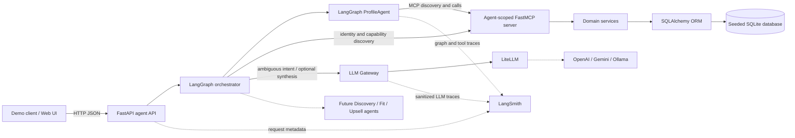
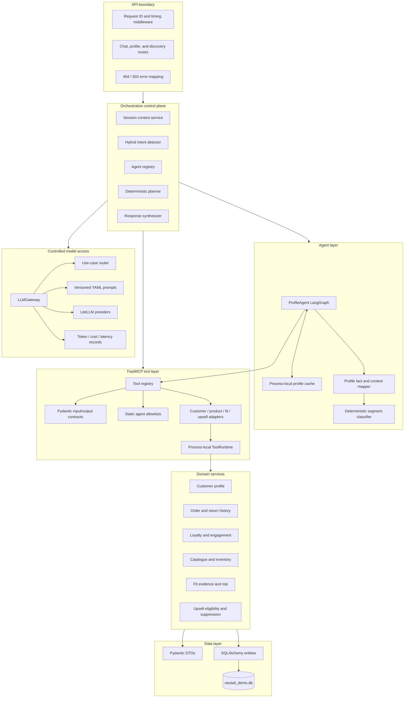
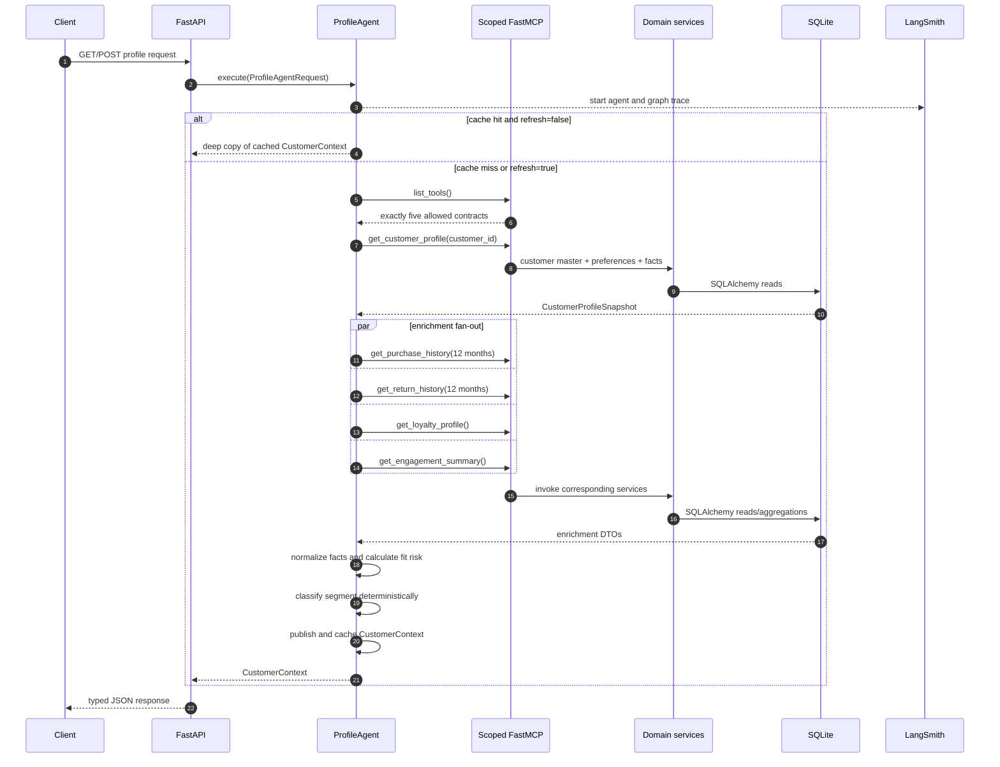
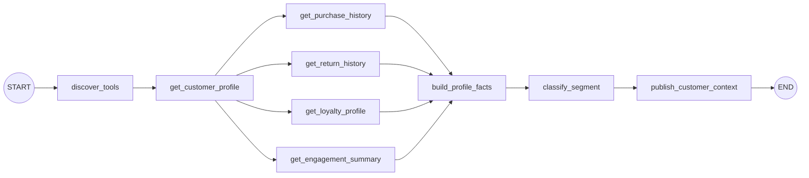
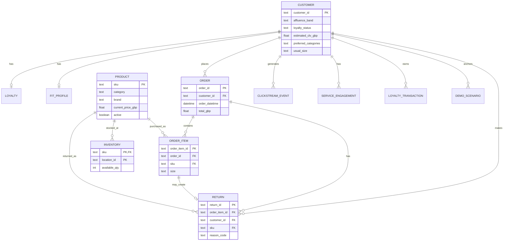
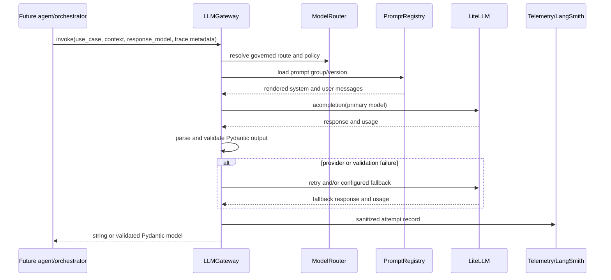

# Neu.Tail System Design

## 1. Purpose and current scope

Neu.Tail is a demo retail-assistant backend organized around agent-scoped tools,
deterministic domain services, and a controlled LLM gateway. The currently
executable application is a vertical slice for customer profiling:

- FastAPI exposes health, profile construction, and profile-tool discovery.
- A LangGraph orchestrator validates identity, manages multi-turn state,
  detects intent, discovers capabilities, plans agents, and synthesizes one
  response.
- A LangGraph `ProfileAgent` builds a normalized `CustomerContext`.
- The agent discovers and calls only its five permitted FastMCP tools.
- Tool adapters call deterministic domain services backed by SQLAlchemy and a
  seeded SQLite database.
- LangSmith instruments API-triggered agent runs and individual tool calls.
- A LiteLLM-based gateway handles ambiguous orchestrator intent and optional
  response prose; the deterministic ProfileAgent intentionally does not call
  an LLM.

Discovery, Fit, and Upsell agent entry-point files are placeholders. Their
domain services, DTOs, and most tool capabilities already exist and form the
extension surface for future slices. The authentication boundary issues and
validates signed demo JWTs, while token revocation and session context remain
process-local.

## 2. Design goals

1. Keep factual data access separate from agent reasoning.
2. Prevent agents from using SQL or domain services directly.
3. Expose typed, discoverable tools with static per-agent permissions.
4. Keep customer segmentation deterministic and explainable.
5. Route all future model calls through one governed gateway.
6. Make each request, graph run, and tool invocation traceable.
7. Remain simple enough to run as a single-process demo.

## 3. System context



Solid lines are active runtime paths. Dashed lines represent optional
observability or specialised-agent extensions not yet implemented.

## 4. Logical architecture



### Component responsibilities

| Component | Current responsibility |
| --- | --- |
| `api/main.py` | Owns the HTTP boundary, application lifespan, request correlation, response timing, and exception-to-status mapping. |
| `orchestrator/` | Owns identity validation, sessions, intent detection, capability discovery, agent routing, state merging, and response synthesis. |
| `agents/profiling/` | Owns profile orchestration, normalization, deterministic segmentation, data-quality reporting, and session-scoped caching. |
| `tools/` | Owns tool definitions, generated schemas, discovery metadata, permission enforcement, and service adapters. |
| `services/` | Owns deterministic data retrieval, aggregation, validation, fit logic, and upsell policy logic. |
| `models/dto.py` | Defines validated models crossing service, tool, agent, gateway, and API boundaries. |
| `models/entities.py` | Maps the seeded database tables and relationships to SQLAlchemy ORM entities. |
| `database/session.py` | Resolves the database URL and creates engines/session factories with SQLite foreign keys enabled. |
| `llm_gateway/` | Owns prompt versions, use-case-to-model routes, LiteLLM invocation, output validation, fallback, and model-call telemetry. |

## 5. API and orchestration design

### Public API

| Method and path | Input | Output | Failure behavior |
| --- | --- | --- | --- |
| `GET /health` | None | Service, agent, and LangSmith status | Normal FastAPI error handling |
| `POST /api/v1/auth/login` | Customer email and shared demo password | Bearer access token and `AuthUser` | Invalid credentials `401`; missing auth configuration `503`; invalid input `422` |
| `GET /api/v1/auth/me` | Signed Bearer JWT | `AuthUser` | Missing, invalid, expired, or revoked token `401` |
| `POST /api/v1/auth/logout` | Signed Bearer JWT | Empty response | Missing, invalid, expired, or revoked token `401` |
| `POST /api/v1/chat` | `ChatRequest` JSON and signed Bearer JWT | `OrchestratorResponse` | Missing/invalid token `401`; unknown customer `404`; cross-customer session `409`; dependency failure `503`; invalid input `422` |
| `GET /api/v1/agents` | None | Agent descriptors and implementation status | Registry initialization is fail-fast |
| `POST /api/v1/profile` | `ProfileAgentRequest` JSON | `CustomerContext` | Unknown customer `404`; workflow failure `503`; invalid input `422` |
| `GET /api/v1/customers/{customer_id}/profile` | `session_id`, optional `trace_id`, optional `refresh` | `CustomerContext` | Unknown customer `404`; workflow failure `503`; invalid input `422` |
| `GET /api/v1/agents/profiling/tools` | None | Profiling-visible `ToolDescriptor[]` | Registry initialization is fail-fast |

Every API response receives `x-request-id` and `x-process-time-ms` headers. If
the client supplies `x-request-id`, the middleware preserves it; otherwise it
generates one. For the GET profile route this ID is also the default graph
`trace_id`.

### Orchestrator workflow

```mermaid
flowchart LR
    OStart((START)) --> Identity[validate_identity]
    Identity --> Load[load_context]
    Load --> Intent[detect_intent]
    Intent --> Merge[merge_context]
    Merge --> Discover[discover_capabilities]
    Discover --> Plan[build_plan]
    Plan --> Execute[execute_plan]
    Execute --> Synthesize[synthesize_response]
    Synthesize --> Persist[persist_context]
    Persist --> OEnd((END))
```



Clear profile, discovery, fit, and service requests are detected by transparent
rules. Ambiguous text is sent to `LLMGateway.invoke()` with current session
entities and a Pydantic `IntentResult`. The deterministic planner prepends
Profiling only when `CustomerContext` is absent, then orders Discovery, Fit, and
Upsell for primary and secondary intents. Unimplemented agents return a
centralized `AGENT_UNAVAILABLE` result; the orchestrator never substitutes its
own product-ranking, fit, or upsell logic.

Sessions are bound to the first customer identity that uses them. They retain
category, occasion, selected SKU, requested size, customer context, last intent,
turn count, and the latest 20 user/assistant messages. Values are copied on
load/save to avoid accidental mutation of stored state.

### Direct profiling execution sequence



### LangGraph workflow



The profile snapshot is mandatory. Purchase, return, loyalty, and engagement
sources are optional: their MCP errors become `MISSING` or `UNAVAILABLE` entries
in `CustomerContext.data_quality`, with safe default values used by the mapper.
A missing mandatory customer becomes `CustomerNotFoundError`.

### Deterministic segmentation

The seeded `customers.segment` column is not used as classifier input. It is
only useful for validating demo output. The agent normalizes
`affluence_band + loyalty_status` and applies this rule matrix:

| Affluence | Loyalty | Published segment | Segment code |
| --- | --- | --- | --- |
| Affluent | Loyal | Prestige Champion | `PRESTIGE_CHAMPION` |
| Less Affluent | Loyal | Value Defender | `VALUE_DEFENDER` |
| Affluent | New | Aspiring Loyalist | `ASPIRING_LOYALIST` |
| Less Affluent | New | Price Explorer | `PRICE_EXPLORER` |

The final `CustomerContext` combines profile preferences, CLV, derived segment,
12-month purchase aggregates, return rate, fit-risk score, loyalty state,
engagement score, data-quality flags, and `profile_version="v1"`.

## 6. FastMCP tool design

### Registration and contracts

`@tool_contract` provides each adapter with a stable name, title, description,
capability, read/write metadata, safety annotations, and allowed-agent metadata.
FastMCP derives JSON input/output schemas from Python type hints and Pydantic
DTOs. `ToolRegistry` materializes all adapters and fails at import time if the
registered tool set differs from the permission policy.

The registry supports:

- listing tools and capabilities globally or by agent;
- describing one tool and its schemas;
- resolving a tool only after permission validation;
- building a full trusted server or an agent-scoped server.

### Permission boundary

Agents receive a server containing only their allowlisted tools. A disallowed
tool is absent during discovery and also rejected by direct registry lookup.
The implemented ProfileAgent additionally verifies that discovery returns
exactly its expected five-tool set before continuing.

| Agent scope | Capability groups in the current registry |
| --- | --- |
| Profiling | Aggregate profile, purchase, return, loyalty, and engagement summaries |
| Discovery | Customer preference/fact reads, product catalogue, and inventory |
| Fit | Customer preferences, product facts, order/return evidence, inventory, and fit calculations |
| Upsell | Customer and loyalty facts, return summary, product facts, engagement, eligibility, suppression, and decision recording |

Only the Profiling scope has an implemented agent workflow today.

### Tool runtime

`ToolRuntime` is lazily created once per process. It owns the SQLAlchemy engine,
session factory, and process-local `UpsellPolicyState`. Every adapter opens a
short-lived session; read calls close without committing, while explicitly
marked write calls commit and roll back on failure. The Profiling Agent uses an
in-process FastMCP client/server transport, so no network hop is required.

## 7. Domain and data design

Domain services receive an injected SQLAlchemy `Session`. They return DTOs, do
not expose ORM objects across boundaries, and own deterministic validation and
aggregation. The current code queries SQLAlchemy directly; a separate
repository layer is not implemented.

| Service | Responsibility |
| --- | --- |
| `CustomerProfileService` | Customer existence, master data, normalized preferences, and profile facts |
| `ProductCatalogService` | Factual structured search, single/bulk SKU lookup, and active-state checks |
| `InventoryService` | Per-location and aggregate availability, including bulk checks |
| `OrderHistoryService` | Orders, purchased items, recent sizes, and purchase summaries |
| `ReturnHistoryService` | Return records, rates, reason summaries, and size/product evidence |
| `FitProfileService` | Fit profile, brand adjustments, evidence construction, and deterministic risk |
| `LoyaltyService` | Current loyalty profile, transactions, and summaries |
| `EngagementService` | Clickstream summaries and service-engagement records |
| `UpsellPolicyService` | Consent, cooldown, frequency, propensity, candidate, and suppression rules |

### Persistence model



The database also contains read-only `customer_360` and
`customer_return_stats` views. Current services calculate against mapped tables
rather than mapping those views as ORM entities. SQLite stores some list fields
as pipe-delimited text and brand adjustments as JSON text; Pydantic validators
normalize them to lists and dictionaries at the DTO boundary.

## 8. Controlled LLM gateway

`LLMGateway` is the shared component for orchestrator intent detection, optional
response synthesis, and future specialised-agent explanations. It is not called
by the deterministic profiling flow and is not exposed directly through
FastAPI.



Configured logical use cases are `intent_detection`, `product_explanation`,
`fit_explanation`, `upsell_message`, `optional_summary`, and
`response_synthesis`. Routes, limits, fallback models, and logging policy live
in `llm_gateway/config/models.yaml`; trusted versioned prompts live under
`llm_gateway/prompts/`.

Every default physical model call uses `litellm.acompletion`. The gateway owns
timeouts, temperature, token limits, fallback, structured-output retries, and
Pydantic validation. It records provider/model, prompt version, attempt,
token usage, latency, status, and provider-reported cost. Raw prompts and model
responses are excluded from traces unless a route explicitly enables them.
Telemetry records are process-local and are also emitted through application
logging.

## 9. Observability and failure handling

### LangSmith trace hierarchy

- `neutail_orchestrator`: top-level chat control-plane run;
- `neutail_orchestrator_graph`: session, routing, execution, and persistence;
- `orchestrator.validate_customer`: MCP-backed identity validation;
- `orchestrator.invoke.<agent>`: one trace per planned agent invocation;
- `profile_agent`: top-level deterministic agent run;
- `profile_agent_graph`: LangGraph execution and node activity;
- `profile_tool_discovery`: scoped MCP discovery;
- one tool trace per FastMCP invocation;
- `llm_gateway.invoke`: governed logical model call;
- `litellm.acompletion`: one trace per physical provider attempt.

Trace metadata includes correlation/trace ID, session ID, customer ID where
applicable, agent, use case, prompt version, logical model, provider model, and
cache-hit status. Tracing is activated through environment configuration and is
safe to disable for local tests.

### Failure strategy

| Failure | Behavior |
| --- | --- |
| Unknown customer | MCP identity validation or mandatory profile lookup fails; API returns structured `404` |
| Session reused by another customer | Session service rejects it; chat API returns structured `409` |
| Planned agent not implemented | Orchestrator records `AGENT_UNAVAILABLE` and returns a controlled partial response |
| Missing/mismatched profile tool scope | Graph stops with a discovery error; API returns `503` |
| Optional enrichment unavailable | Profile still publishes with defaults and a data-quality flag |
| Invalid request/response DTO | Pydantic rejects it at the relevant boundary |
| Unknown LLM use case/prompt version | Gateway rejects before contacting a provider |
| Invalid structured LLM output | Governed retry, then configured fallback, then `LLMInvocationError` |
| Provider timeout/error | Attempt is accounted and fallback is tried when allowed |

## 10. Runtime and deployment

The demo runs as one Uvicorn process:

```text
Uvicorn process
  ├── FastAPI application
  ├── one lifespan-owned NeuTailOrchestrator
  │   ├── LangGraph control-plane workflow
  │   ├── in-memory SessionContextService
  │   └── agent registry and shared LLMGateway
  ├── one lifespan-owned ProfileAgent
  │   └── in-memory (session_id, customer_id) cache
  ├── one lazy ToolRuntime
  │   ├── SQLAlchemy engine/session factory
  │   └── in-memory upsell policy state
  ├── in-process FastMCP servers/clients
  ├── optional LLMGateway instances
  └── local database/neutail_demo.db
```

Configuration is environment-based:

- `NEUTAIL_DATABASE_URL` overrides the bundled SQLite URL;
- `NEUTAIL_JWT_SECRET` supplies the HS256 token signing/validation secret;
- `NEUTAIL_DEMO_PASSWORD` supplies the shared local-demo login password;
- `NEUTAIL_ACCESS_TOKEN_TTL_SECONDS` optionally changes the one-hour token
  lifetime, up to one day;
- `LANGSMITH_TRACING`, `LANGSMITH_API_KEY`, and `LANGSMITH_PROJECT` control
  tracing;
- provider API keys are required only for LLM routes used in a demo;
- `LITELLM_LOCAL_MODEL_COST_MAP=True` keeps LiteLLM model-cost data local.
- `NEUTAIL_RESPONSE_SYNTHESIS_LLM=true` opts into governed LLM prose
  synthesis; deterministic templates are the default.

The application is started with:

```bash
./bin/uvicorn api.main:app --reload
```

## 11. Security and trust boundaries

Current controls:

- Pydantic validates boundary data and rejects unknown fields.
- SQLAlchemy query construction avoids interpolated SQL in service inputs.
- Prompt paths accept only safe group/version patterns.
- Agent tool exposure is least-privilege and enforced at registry construction.
- Tool contracts declare read-only/idempotent/destructive hints.
- LLM traces omit raw request and response bodies by default.
- SQLite foreign-key enforcement is enabled on every connection.

Demo limitations:

- Customer passwords and roles are not stored. Every seeded customer uses one
  environment-configured demo password and receives the `customer` role.
- Logout revocation is process-local; audience/issuer validation and
  authorization beyond the JWT customer subject are not implemented.
- There is no rate limiting, request-size policy, or network-level MCP security.
- The session identifier remains caller-provided and process-local.
- Secrets are expected through environment variables; no secret manager exists.
- Process-local caches and telemetry disappear on restart and are not shared
  across workers.

## 12. Scalability, consistency, and known gaps

The design is intentionally single-process. Before production use:

1. Replace the demo HS256 secret with an external token issuer, asymmetric key
   verification, audience/issuer policy, rotation, and customer authorization.
2. Add session history/management APIs if required by the UI.
3. Implement Discovery, Fit, and Upsell agent workflows against their scoped
   FastMCP servers and route every model call through `LLMGateway`.
4. Move SQLite to a managed relational database and add a repository layer if
   multiple persistence implementations are required.
5. Replace process-local profile cache and upsell state with a TTL-based shared
   store; define invalidation from customer/order/return events.
6. Persist model-call audit records and define retention/redaction policy.
7. Add migrations, readiness checks, structured logging, metrics, rate limits,
   and tracing sampling.
8. Avoid `--reload`, run multiple workers only after shared state is external,
   and define explicit connection-pool limits.

## 13. Verification strategy

The current automated suite covers:

- all four deterministic segmentation branches;
- exact ProfileAgent tool scope and denial of product tools;
- seeded customer-context construction;
- unknown-customer behavior;
- per-session cache reuse and explicit refresh;
- health, GET/POST profile, tool discovery, headers, and API error mapping;
- orchestrated profile chat, runtime agent discovery, compound planning,
  multi-turn reuse, identity binding, and unavailable-agent fallback;
- LLM route/prompt resolution, direct LiteLLM wiring, structured output,
  retries, fallback, telemetry, and sanitized tracing behavior.

Run it with:

```bash
LANGSMITH_TRACING=false LITELLM_LOCAL_MODEL_COST_MAP=True \
  ./bin/python -m pytest -q
```
